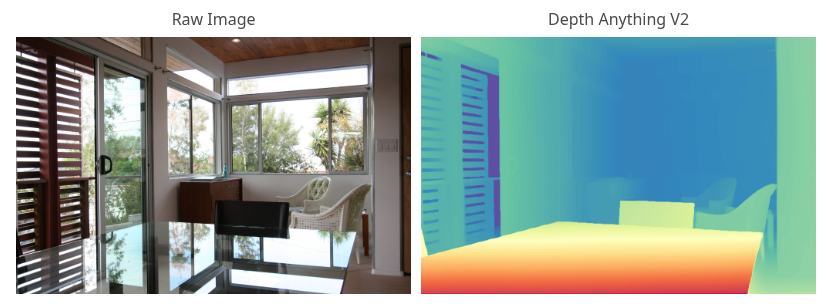
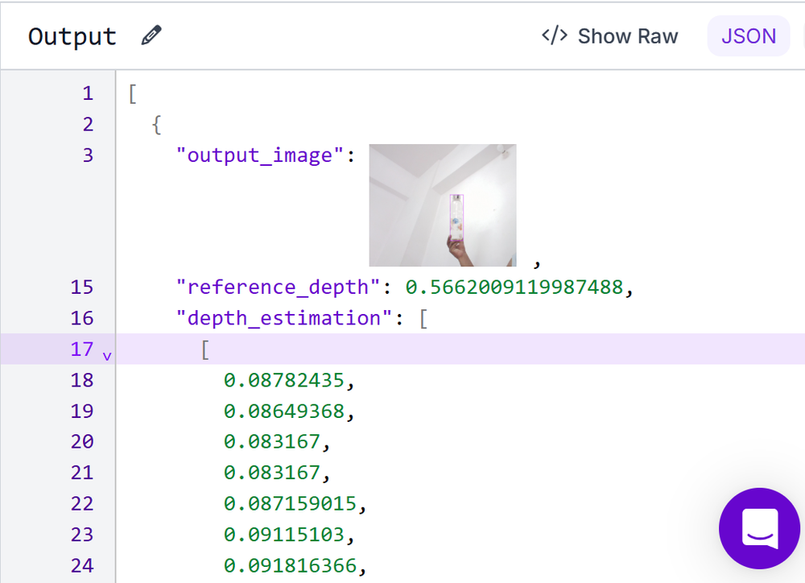
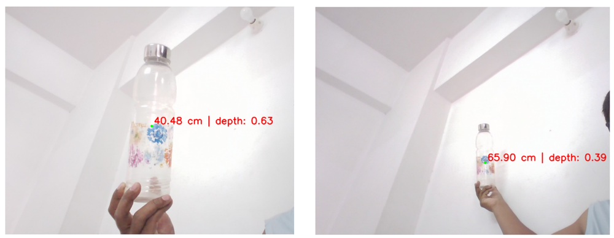
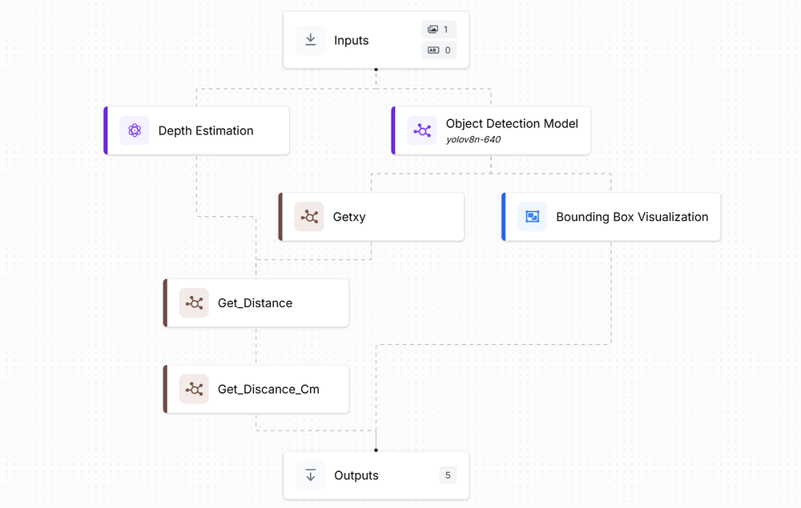

# Calculating Distance Between Object and Monocular Camera

Estimating the real-world distance of an object from a single (monocular) RGB camera, using object detection combined with monocular depth estimation and a reference-based calibration technique.


*Depth Anything V2 used for metric depth estimation, the core depth model powering this pipeline.*

## Overview

Measuring distance with a single camera is inherently ambiguous — unlike stereo or LiDAR setups, a monocular image has no built-in scale reference. This project solves that problem with a practical calibration approach:

1. **Detect** the object of interest in the frame using an object detection model.
2. **Estimate depth** for the full scene using a monocular depth estimation model.
3. **Sample** the depth value at the center of the object's bounding box.
4. **Calibrate** by relating a known real-world distance to its corresponding model depth value.
5. **Scale** future depth readings against that reference to estimate real-world distance in centimeters.

This pipeline was implemented and run **locally**, after two earlier approaches were explored:

- **MGNet** (monocular panoptic segmentation + self-supervised depth) — a strong academic multi-task framework, but oriented toward research benchmarks (Cityscapes/KITTI) rather than plug-and-play deployment.
- **YOLO11-based detection pipeline** — an earlier attempt paired object detection with a depth model that ultimately proved unreliable for real-world distance calibration.

Because of that, only the **object detection and distance-display logic** (bounding boxes, center-point marking, and drawing the distance label on the frame) was carried over from that earlier approach. The actual **depth estimation and distance calculation** are done differently — using **Depth Anything V2** together with the reference-calibration technique described below, which proved reliable when run locally.

## How It Works

### 1. Reference Calibration
Before estimating unknown distances, the system needs a baseline:
- Place the target object at a **known distance** from the camera (e.g., 45 cm).
- Run object detection to get its bounding box, then compute the box center.
- Run the depth model on the same image and read the depth value at that center pixel.
- Store this as the **reference depth**, paired with the known **reference distance**.


*The calibration workflow: object detection + depth estimation combined to compute a reference depth at a known distance.*


*Example output of the calibration step, showing the detected object and its resulting reference depth value.*

### 2. Distance Estimation
For any new frame:
- Detect the object and find its bounding box center.
- Read the depth value at that point from the depth map.
- Convert it to a real-world distance using:

```
estimated_distance_cm = (reference_depth / object_depth) * reference_distance_cm
```


*The full "Camera to Object Distance" workflow: detection, depth lookup, and conversion to real-world distance.*


*Example output: detected object with its estimated distance from the camera annotated on the image.*

### 3. (Optional) Multi-Point Calibration for Better Accuracy
A single calibration point assumes the depth model behaves linearly across all distances, which isn't always true. Accuracy can be improved by:
- Capturing depth values at several known distances (e.g., 30 cm, 60 cm, 100 cm, 150 cm).
- Fitting a mapping function (linear, polynomial, or exponential) between depth values and real-world distance.
- Using that fitted function instead of a single fixed ratio for predictions.

## Pipeline Components

| Stage | Purpose |
|---|---|
| Object Detection | Locates the target object and returns its bounding box |
| Center Extraction | Computes the (x, y) center of the bounding box |
| Depth Estimation | Produces a per-pixel depth map of the scene |
| Reference Depth Lookup | Reads depth at the object center during calibration |
| Distance Calculation | Converts depth ratio into a real-world distance (cm) |
| Visualization | Draws the bounding box, center point, and distance label on the frame |

## Usage

1. **Calibrate**: Capture an image with the object at a known distance and record the reference depth.
2. **Update** the reference values (`reference_depth`, `reference_distance_cm`) in the distance calculation step.
3. **Run** the pipeline on new images or video to get live distance estimates.
4. **Improve accuracy** (optional) by collecting multiple calibration points and fitting a mapping function instead of a single ratio.


*Video demo: the pipeline running on a video stream, annotating each frame with the object's estimated distance in real time.*

## Notes & Limitations

- Accuracy depends heavily on the quality and consistency of the calibration step — recalibrate if the camera, lens, or object type changes.
- The current implementation assumes a single object of interest per frame.
- Depth model outputs are normalized/relative, not metric by default — the calibration step is what converts them into real-world units.
- Lighting conditions, object texture, and distance range can all affect depth estimation quality; validating across multiple known distances is recommended before relying on this in production or safety-critical settings.

## Background / Related Work

- **MGNet** — Schön et al., *"MGNet: Monocular Geometric Scene Understanding for Autonomous Driving"* — combines panoptic segmentation with self-supervised monocular depth estimation in a single real-time model. Explored as an early reference for monocular scene understanding.
- **YOLO11 detection + distance-visualization (Medium article)** — only the **object detection and distance-visualization** parts (bounding box drawing, center-point marking, distance text overlay) were reused from this approach; its depth estimation component was not used.
- **Depth Anything V2 + reference-calibration workflow** — the source of the actual **depth estimation and distance calculation** logic used in this project, adapted from a calibration-based workflow (known-distance reference → depth ratio → real-world distance in cm).
